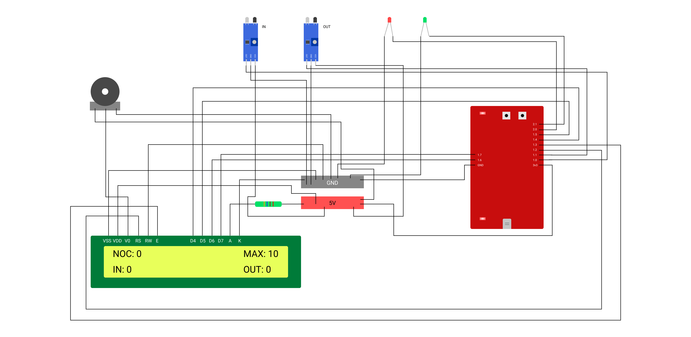

## Car Parking System

(#aadityarajkumawat, #harshkhandelwal)

---

Design and implement a circuit using MSP430G2553 and sensors (IR), to detect when a car enters and exits the parking lot and display the parking lot information like number of cars parked, numbers of cars entered and so on, on LCD display.

### Working

The model takes in inputs from two IR sensors, one is used to detect the number of cars entering the parking lot while the other sensor is used to detect the number of cars leaving the parking lot. The program loaded on MSP430 keeps track of the state of parking lot by keeping the number of cars currently present, total number of cars that have entered, total number of cars that have exited and it also keeps track that no car will be allowed once the maximum capacity of parking lot is reached.

### Circuit diagram



### Working Model

<iframe width="860" height="515" src="https://www.youtube.com/embed/FyNmJJnIq9c" title="YouTube video player" frameborder="0" allow="accelerometer; autoplay; clipboard-write; encrypted-media; gyroscope; picture-in-picture" allowfullscreen></iframe>

### Code

> Get complete project at [@Stool Softwares](https://github.com/Stool-Softwares)

```c
// car-parking-system.c
#include <msp430.h>
#include <inttypes.h>
#include <stdio.h>
#include <string.h>
#define CMD 0
#define DATA 1
#define LCD_OUT P1OUT
#define LCD_DIR P1DIR
#define D4 BIT4
#define D5 BIT5
#define D6 BIT6
#define D7 BIT7
#define RS BIT2
#define EN BIT3
#define ENTRY BIT0
#define EXIT BIT1
#define RED BIT0
#define GREEN BIT1

void delay(uint16_t t) {
    uint16_t i;
    for (i = t; i > 0; i--)
        __delay_cycles(100);
}

void pulseEN(void) {
    LCD_OUT |= EN;
    delay(1);
    LCD_OUT &= ~EN;
    delay(1);
}

void lcd_write(uint8_t value, uint8_t mode) {
    if (mode == CMD)
        LCD_OUT &= ~RS;
    else
        LCD_OUT |= RS;
    LCD_OUT = ((LCD_OUT & 0x0F) | (value & 0xF0));
    pulseEN();
    delay(1);
    LCD_OUT = ((LCD_OUT & 0x0F) | ((value << 4) & 0xF0));
    pulseEN();
    delay(1);
}

void lcd_print(char* s) {
    while (*s)
    {
        lcd_write(*s, DATA);
        s++;
    }
}

void lcd_setCursor(uint8_t row, uint8_t col)
{
    const uint8_t row_offsets[] = { 0x00, 0x40 };
    lcd_write(0x80 | (col + row_offsets[row]), CMD);
    delay(1);
}

void lcd_init()
{
    LCD_DIR |= (D4 + D5 + D6 + D7 + RS + EN);
    LCD_OUT &= ~(D4 + D5 + D6 + D7 + RS + EN);
    delay(150);
    lcd_write(0x33, CMD);
    delay(50);
    lcd_write(0x32, CMD);
    delay(1);
    lcd_write(0x28, CMD);
    delay(1);
    lcd_write(0x0C, CMD);
    delay(1);
    lcd_write(0x01, CMD);
    delay(20);
    lcd_write(0x06, CMD);
    delay(1);
    lcd_setCursor(0, 0);
}

void lcd_printNumberOfEnteredCars(char cars_entered[100]) {
    lcd_setCursor(1, 1);
    lcd_print("IN:");
    lcd_setCursor(1, 4);
    lcd_print(cars_entered);
    delay(20);
}

void lcd_printNumberOfExitedCars(char cars_exited[100]) {
    lcd_setCursor(1, 10);
    lcd_print("OUT:");
    lcd_setCursor(1, 14);
    lcd_print(cars_exited);
    delay(20);
}

void clear_lcd() {
    lcd_setCursor(0, 0);
    int i = 0;
    for (i = 0; i < 16; i++) {
        lcd_print(" ");
    }
    lcd_setCursor(1, 0);
    for (i = 0; i < 16; i++) {
        lcd_print(" ");
    }
}

void print_parking_is_filled() {
    lcd_setCursor(1, 1);
    lcd_print("Parking filled");
}

void main(void) {
    WDTCTL = WDTPW | WDTHOLD;
    int MIN_PARKING_CAPACITY = 0;
    int MAX_PARKING_CAPACITY = 10;
    lcd_init();
    P2DIR |= BIT3;
    P1DIR &= ~ENTRY;
    P1DIR &= ~EXIT;
    P2DIR |= RED;
    P2DIR |= GREEN;
    int number_of_cars = 0;
    int number_of_cars_entered = 0;
    int number_of_cars_left = 0;
    char cars[100];
    char cars_entered[100];
    char cars_left[100];
    int entry_state = 0;
    int exit_state = 0;
    int filled = 0;
    while (1)
    {
        sprintf(cars, "%d", number_of_cars);
        sprintf(cars_entered, "%d", number_of_cars_entered);
        sprintf(cars_left, "%d", number_of_cars_left);
        lcd_setCursor(0, 1);
        lcd_print("NOC:");
        lcd_setCursor(0, 5);
        lcd_print(cars);
        lcd_setCursor(0, 10);
        lcd_print("MAX:10");
        if (filled == 1) {
            print_parking_is_filled();
        }
        delay(6000);
        lcd_write(0x01, CMD);
        if (!(P1IN & ENTRY) && entry_state == 0 && filled != 1) {
            entry_state = 1;
            number_of_cars++;
            number_of_cars_entered++;
            P2OUT |= RED;
            if (number_of_cars == MAX_PARKING_CAPACITY) {
                filled = 1;
                clear_lcd();
            }
        }
        else if (P1IN & ENTRY) {
            P2OUT &= ~RED;
            entry_state = 0;
        }
        if (!(P1IN & EXIT) && exit_state == 0) {
            if (number_of_cars > MIN_PARKING_CAPACITY) {
                exit_state = 1;
                number_of_cars--;
                number_of_cars_left++;
                P2OUT |= GREEN;
                if (filled == 1 && number_of_cars < MAX_PARKING_CAPACITY) {
                    filled = 0;
                }
            }
        }
        else if (P1IN & EXIT) {
            P2OUT &= ~GREEN;
            exit_state = 0;
        }
        delay(20);
        lcd_printNumberOfEnteredCars(cars_entered);
        lcd_printNumberOfExitedCars(cars_left);
    }
}
```
