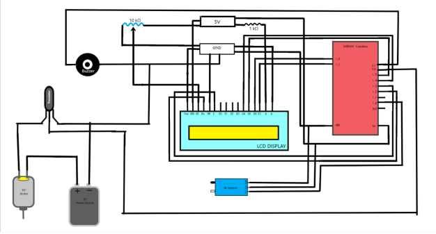
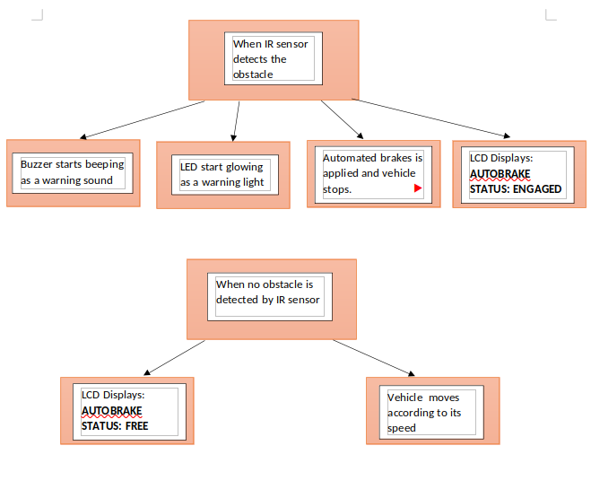

## Car Security System

(#aditshrivastava, #jayasodhani)

---

Use MSP430 and IR sensor to make a security system for cars by controlling the breaks and display the output on LCD display. Also, use LED and buzzer as a indicator for warning.

### Working

Obstacle scanners can be used in “Vehicle Braking Systems” to protect vehicle from getting damaged riding. Our project acts as a security feature for vehicle so that if a person or any obstacle comes in front of vehicle, it is detected by the IR sensor and emergency brakes are initiated, hence the vehicle stops.

### Circuit diagram




### Working Model

<iframe width="860" height="515" src="https://www.youtube.com/embed/r-8bYouD0Nc" title="YouTube video player" frameborder="0" allow="accelerometer; autoplay; clipboard-write; encrypted-media; gyroscope; picture-in-picture" allowfullscreen></iframe>

### Code

> Get complete project at [@Stool Softwares](https://github.com/Stool-Softwares)

```c
// car-security-system.c
#include <msp430.h>
#include <inttypes.h>
#include <stdio.h>

#define CMD         0
#define DATA        1

#define LCD_OUT     P1OUT
#define LCD_DIR     P1DIR
#define D4          BIT4
#define D5          BIT5
#define D6          BIT6
#define D7          BIT7
#define RS          BIT2
#define EN          BIT3
#define SW          BIT0

void delay(uint16_t t)
{
    uint16_t i;
    for(i=t; i > 0; i--)
        __delay_cycles(100);
}

void pulseEN(void)
{
    LCD_OUT |= EN;
    delay(1);
    LCD_OUT &= ~EN;
    delay(1);
}

void lcd_write(uint8_t value, uint8_t mode)
{
    if(mode == CMD)
        LCD_OUT &= ~RS;
    else
        LCD_OUT |= RS;

    LCD_OUT = ((LCD_OUT & 0x0F) | (value & 0xF0));
    pulseEN();
    delay(1);

    LCD_OUT = ((LCD_OUT & 0x0F) | ((value << 4) & 0xF0));
    pulseEN();
    delay(1);
}

void lcd_print(char *s)
{
    while(*s)
    {
        lcd_write(*s, DATA);
        s++;
    }
}

void lcd_setCursor(uint8_t row, uint8_t col)
{
    const uint8_t row_offsets[] = { 0x00, 0x40};
    lcd_write(0x80 | (col + row_offsets[row]), CMD);
    delay(1);
}

void lcd_init()
{
    LCD_DIR |= (D4+D5+D6+D7+RS+EN);
    LCD_OUT &= ~(D4+D5+D6+D7+RS+EN);

    delay(150);
    lcd_write(0x33, CMD);
    delay(50);
    lcd_write(0x32, CMD);
    delay(1);

    lcd_write(0x28, CMD);
    delay(1);

    lcd_write(0x0C, CMD);
    delay(1);

    lcd_write(0x01, CMD);
    delay(20);

    lcd_write(0x06, CMD);
    delay(1);

    lcd_setCursor(0,0);
}

void main(void) {
    WDTCTL = WDTPW | WDTHOLD;

    lcd_init();

    P2DIR |= BIT3;
    P1DIR &= ~SW;

    P2DIR |= 0x01;
    P2DIR |= 0x02;

    while(1)
    {
        if(!(P1IN & SW))
        {
            delay(2000);
            lcd_write(0x01, CMD);
            delay(20);
            lcd_setCursor(0,0);
            lcd_print("AUTOBRAKE STATUS");
            lcd_setCursor(1,4);
            lcd_print("FREE");
            P2OUT |= 0x01;
            P2OUT &= ~0x02;
            delay(1000);
        }
        else{
            delay(2000);
            lcd_write(0x01, CMD);
            delay(20);
            lcd_setCursor(0,0);
            lcd_print("AUTOBRAKE STATUS");
            lcd_setCursor(3,6);
            lcd_print("ENGAGED");
            P2OUT &= ~0x01;
            P2OUT |= 0x02;
            delay(1000);
        }
    }
}
```
