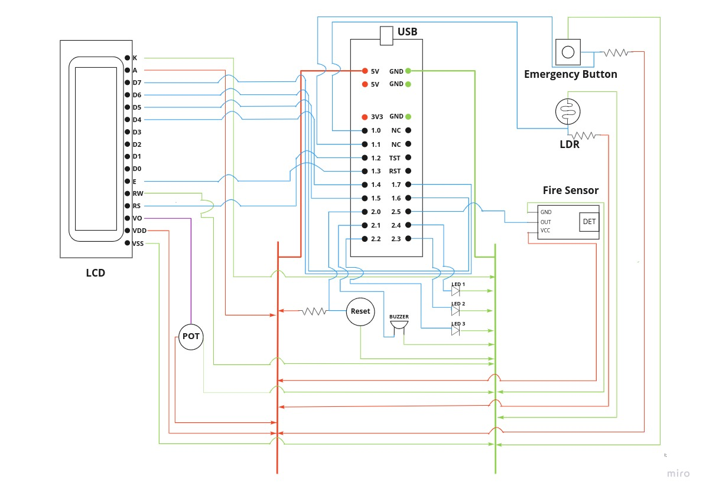

## Home Security System

(#namishkhandelwal, #kaustubhsingh)

---

This is a home security system which can provide security against theft or fire by automatically notifying concerned authorities (police or fire department) and ring a buzzer to alarm people staying in the house also it has a health emergency button which can notify ambulance with just one press in case of any medical emergency.

### Working

The sensors reads data from environment and give input to the MSP 430 lunchbox which processes it according to the compiled code and then it sends output signal to different components.

### Circuit diagram



### Working Model

<iframe width="860" height="515" src="https://www.youtube.com/embed/wwZbwZj7BJ8" title="YouTube video player" frameborder="0" allow="accelerometer; autoplay; clipboard-write; encrypted-media; gyroscope; picture-in-picture" allowfullscreen></iframe>

### Code

> Get complete project at [@Stool Softwares](https://github.com/Stool-Softwares)

```c
// home-security-system.c
#include <msp430.h>

#include <inttypes.h>

#define CMD 0
#define DATA 1
#define LCD_OUT P1OUT
#define LCD_DIR P1DIR
#define D4 BIT4
#define D5 BIT5
#define D6 BIT6
#define D7 BIT7
#define RS BIT2
#define EN BIT3
#define LDR BIT0
#define EME BIT1
#define FIR BIT5
#define LED1 BIT4
#define LED2 BIT3
#define LED3 BIT2
#define RST BIT0
#define BZR BIT1
/**
 *@brief Delay function for producing delay in 0.1 ms increments
 *@param t milliseconds to be delayed
 *@return void
 **/
void delay(uint16_t t) {
    uint16_t i;
    for (i = t; i > 0; i--)
        __delay_cycles(100);
}
/**
 *@brief Function to pulse EN pin after data is written
 *@return void
 **/
void pulseEN(void) {
    LCD_OUT |= EN; // Giving a falling edge at EN pin
    delay(1);
    LCD_OUT &= ~EN;
    delay(1);
}
/**
 *@brief Function to write data/command to LCD
 *@param value Value to be written to LED
 *@param mode Mode -> Command or Data
 *@return void
 **/
void lcd_write(uint8_t value, uint8_t mode) {
    if (mode == CMD)
        LCD_OUT &= ~RS; // Set RS -> LOW for Command mode
    else
        LCD_OUT |= RS; // Set RS -> HIGH for Data mode
    LCD_OUT = ((LCD_OUT & 0x0F) | (value & 0xF0)); // Write high nibble first
    pulseEN();
    delay(1);
    LCD_OUT = ((LCD_OUT & 0x0F) | ((value << 4) & 0xF0)); // Write low nibble next
    pulseEN();
    delay(1);
}
/**
 *@brief Function to print a string on LCD
 *@param *s pointer to the character to be written.
 *@return void
 **/
void lcd_print(char * s) {
    while ( * s) {
        lcd_write( * s, DATA);
        s++;
    }
}
/**
 *@brief Function to move cursor to desired position on LCD
 *@param row Row Cursor of the LCD
 *@param col Column Cursor of the LCD
 *@return void
 **/
void lcd_setCursor(uint8_t row, uint8_t col) {
    const uint8_t row_offsets[] = {
        0x00,
        0x40
    };
    lcd_write(0x80 | (col + row_offsets[row]), CMD);
    delay(1);
}
/**
 *@brief Initialize LCD
 **/
void lcd_init() {
    LCD_DIR |= (D4 + D5 + D6 + D7 + RS + EN);
    LCD_OUT &= ~(D4 + D5 + D6 + D7 + RS + EN);
    delay(150); // Wait for power up ( 15ms )
    lcd_write(0x33, CMD); // Initialization Sequence 1
    delay(50); // Wait ( 4.1 ms )
    lcd_write(0x32, CMD); // Initialization Sequence 2
    delay(1); // Wait ( 100 us )
    // All subsequent commands take 40 us to execute, except clear & cursor return (1.64 ms)
    lcd_write(0x28, CMD); // 4 bit mode, 2 line
    delay(1);
    lcd_write(0x0C, CMD); // Display ON, Cursor OFF, Blink OFF
    delay(1);
    lcd_write(0x01, CMD); // Clear screen
    delay(20);
    lcd_write(0x06, CMD); // Auto Increment Cursor
    delay(1);
    lcd_setCursor(0, 0); // Goto Row 1 Column 1
}
/*@brief entry point for the code*/
void main(void) {
    WDTCTL = WDTPW + WDTHOLD; //! Stop Watchdog (Not recommended for code in production and devices working in
    field)
P1DIR &= ~LDR;
P2DIR |= BZR;
P2DIR &= ~FIR;
P1DIR &= ~EME;
P2DIR &= ~RST;
P2DIR |= LED1;
P2DIR |= LED2;
P2DIR |= LED3;
P2OUT &= ~BZR;
lcd_init();
P2OUT &= ~LED1;
P2OUT &= ~LED2;
P2OUT &= ~LED3;
lcd_write(0x01, CMD);
delay(200);
lcd_setCursor(0, 2);
lcd_print("Welcome to");
lcd_setCursor(1, 0);
lcd_print("Security System");
while (1) {
    if (!(P1IN & LDR)) {
        delay(20); // Wait 20ms to debounce
        P2OUT &= ~BZR;
        P2OUT &= ~LED1;
        P2OUT &= ~LED2;
        P2OUT &= ~LED3;
        lcd_write(0x01, CMD);
        delay(20);
        lcd_setCursor(0, 2);
        lcd_print("Welcome to");
        lcd_setCursor(1, 0);
        lcd_print("Security System");
        delay(200);
    } else {
        lcd_setCursor(0, 2);
        lcd_print("intruder!!!");
        lcd_setCursor(1, 2);
        lcd_print("calling 100");
        while ((P2IN & RST)) {
            P2OUT |= BZR;
            P2OUT |= LED1;
            P2OUT |= LED2;
            P2OUT &= ~LED3;
            delay(2000);
            P2OUT &= ~BZR;
            P2OUT &= ~LED1;
            P2OUT |= LED3;
            delay(2000);
        }
    }
    if (!(P1IN & EME)) {
        delay(200);
        while (P2IN & RST) {
            lcd_write(0x01, CMD);
            delay(20);
            lcd_print("Emergancy ");
            lcd_setCursor(1, 2);
            lcd_print("calling 108");
            delay(200);
        }
        lcd_write(0x01, CMD);
        delay(20);
        lcd_setCursor(0, 2);
        lcd_print("Welcome to");
        lcd_setCursor(1, 0);
        lcd_print("Security System");
    }
    if (!(P2IN & FIR)) {
        delay(20); // Wait 20ms to debounce
        P2OUT &= ~BZR;
        P2OUT &= ~LED1;
        P2OUT &= ~LED2;
        P2OUT &= ~LED3;
        lcd_write(0x01, CMD);
        delay(20);
        lcd_setCursor(0, 2);
        lcd_print("Welcome to");
        lcd_setCursor(1, 0);
        lcd_print("Security System");
        delay(200);
    } else {
        lcd_write(0x01, CMD);
        delay(20);
        lcd_setCursor(0, 2);
        lcd_print("Fire!!!");
        lcd_setCursor(1, 2);
        lcd_print("calling 101");
        while ((P2IN & RST)) {
            P2OUT |= BZR;
            P2OUT |= LED1;
            P2OUT |= LED2;
            P2OUT &= ~LED3;
            delay(2000);
            P2OUT &= ~BZR;
            P2OUT &= ~LED1;
            P2OUT |= LED3;
            delay(2000);
        }
    }
}
}
```
