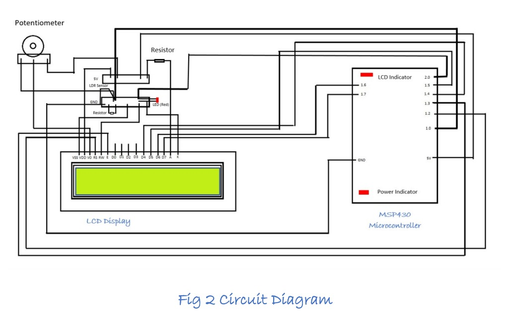

## Visitor Counter

(#shivangi shukla, #vardhana sharma)

---

A visitor counter is a device which has a wide range of applications to monitor the total number of individuals at a place. A visitor counter is designed and implemented using microcontroller MSP430G2553 and LDR (Light Dependent Resistor) sensors, a Light sensor which will keep a watch on the total number of visitors at a place.

### Working

The LDR sensor is placed at the door of the vaccination centre, if a person obstructs the line of sight of sensor, the sensor will send a binary signal to MSP430 for further processing, which includes the glowing of red LED. With the LED glow, the no. of vaccinations increase everytime by 1 on the LCD.

### Circuit diagram



### Working Model

<iframe width="860" height="515" src="https://www.youtube.com/embed/PQF0Ub9AGoE" title="YouTube video player" frameborder="0" allow="accelerometer; autoplay; clipboard-write; encrypted-media; gyroscope; picture-in-picture" allowfullscreen></iframe>

### Code

> Get complete project at [@Stool Softwares](https://github.com/Stool-Softwares)

```c
// visitor-counter.c
#include <msp430.h>
#include <inttypes.h>
#include<stdio.h>
#define AIN         BIT0
#define AIN2        BIT1
#define CMD         0
#define DATA        1

#define LCD_OUT     P1OUT
#define LCD_DIR     P1DIR
#define D4          BIT4
#define D5          BIT5
#define D6          BIT6
#define D7          BIT7
#define RS          BIT2
#define EN          BIT3

int count=0;
int c=0;
/**
 *@brief Delay function for producing delay in 0.1 ms increments
 *@param t milliseconds to be delayed
 *@return void
 **/
void delay(uint16_t t)
{
    uint16_t i;
    for(i=t; i > 0; i--)
        __delay_cycles(100);
}

/**
 *@brief Function to pulse EN pin after data is written
 *@return void
 **/

void pulseEN(void)
{
    LCD_OUT |= EN;
    delay(1);
    LCD_OUT &= ~EN;
    delay(1);
}

/**
 *@brief Function to write data/command to LCD
 *@param value Value to be written to LED
 *@param mode Mode -> Command or Data
 *@return void
 **/
void lcd_write(uint8_t value, uint8_t mode)
{
    if(mode == CMD)
        LCD_OUT &= ~RS;             // Set RS -> LOW for Command mode
    else
        LCD_OUT |= RS;              // Set RS -> HIGH for Data mode

    LCD_OUT = ((LCD_OUT & 0x0F) | (value & 0xF0));              // Write high nibble first
    pulseEN();
    delay(1);

    LCD_OUT = ((LCD_OUT & 0x0F) | ((value << 4) & 0xF0));       // Write low nibble next
    pulseEN();
    delay(1);
}

/**
 *@brief Function to print a string on LCD
 *@param *s pointer to the character to be written.
 *@return void
 **/
void lcd_print(char *s)
{
    while(*s)
    {
        lcd_write(*s, DATA);
        s++;
    }
}

/**
 *@brief Function to move cursor to desired position on LCD
 *@param row Row Cursor of the LCD
 *@param col Column Cursor of the LCD
 *@return void
 **/

void lcd_setCursor(uint8_t row, uint8_t col)
{
    const uint8_t row_offsets[] = { 0x00, 0x40};
    lcd_write(0x80 | (col + row_offsets[row]), CMD);
    delay(1);
}

/**
 *@brief Function to change numeric value into it's corresponding char array
 *@param num Number which has to be displayed
 *@return void
 **/

void lcd_printNumber(unsigned int num)
{
    char buf[3];                        // Creating a array of size 3
    char *str = &buf[2];                // Initializing pointer to end of the array

    *str = '\0';                        // storing null pointer at end of string

    do
    {
        unsigned long m = num;          // Storing number in variable m
        num /= 10;                      // Dividing number by 10
        char c = (m - 10 * num) + '0';  // Finding least place value and adding it to get character value of digit
        *--str = c;                     // Decrementing pointer value and storing character at that character
    } while(num);

    lcd_print(str);
}

/**
 *@brief Initialize LCD
 **/

void lcd_init()
{
    LCD_DIR |= (D4+D5+D6+D7+RS+EN);
    LCD_OUT &= ~(D4+D5+D6+D7+RS+EN);

    delay(150);                     // Wait for power up ( 15ms )
    lcd_write(0x33, CMD);           // Initialization Sequence 1
    delay(50);                      // Wait ( 4.1 ms )
    lcd_write(0x32, CMD);           // Initialization Sequence 2
    delay(1);                       // Wait ( 100 us )

    // All subsequent commands take 40 us to execute, except clear & cursor return (1.64 ms)

    lcd_write(0x28, CMD);           // 4 bit mode, 2 line
    delay(1);

    lcd_write(0x0C, CMD);           // Display ON, Cursor OFF, Blink OFF
    delay(1);

    lcd_write(0x01, CMD);           // Clear screen
    delay(20);

    lcd_write(0x06, CMD);           // Auto Increment Cursor
    delay(1);

    lcd_setCursor(0,0);             // Goto Row 1 Column 1
}

void register_settings_for_ADC10()
    {
        ADC10AE0 |= AIN;                            // P1.0 ADC option select
        ADC10CTL1 = INCH_0;                         // ADC Channel -> 1 (P1.0)
        ADC10CTL0 = SREF_0 + ADC10SHT_3 + ADC10ON;  // Ref -> Vcc, 64 CLK S&H , ADC - ON
    }


//@brief entry point for the code/
void main(void)
{
    WDTCTL = WDTPW + WDTHOLD;                       //! Stop Watchdog (Not recommended for code in production and devices working in field)

    lcd_init();                                     // Initializing LCD

    register_settings_for_ADC10();

    P2DIR |= 0x01;
    P2DIR |= 0x02;
    while(1)
    {

        ADC10CTL0 |= ENC + ADC10SC;             // Sampling and conversion start

        while(ADC10CTL1 & ADC10BUSY);           // Wait for conversion to end
        float adc_value = 0;
        adc_value = (ADC10MEM) * (8.30) / (1023.00);    // mapping 10-bit conversion result of ADC to corresponding voltage

       // int int_part = adc_value;                                   // Integer part of calculated ADC value
       // int decimal_part = (adc_value - (float)int_part) * 10.0 ;  // Decimal part of calculated ADC value
        lcd_write(0x01, CMD);                   // Clear screen
       /* delay(20);
        lcd_setCursor(0,0);
        lcd_print("LDR Reading");
        lcd_setCursor(1,3);
        decimal_part = (adc_value - (float)int_part) * 10.0;
        lcd_printNumber(int_part);              // Displaying integer part of ADC value
        lcd_print(".");
        lcd_printNumber(decimal_part);          // Displaying decimal part of ADC value
        lcd_setCursor(1,7);
        lcd_print("V");
        delay(6000);*/
        lcd_setCursor(0,1);
        lcd_print(" No. of People");
       /* lcd_setCursor(1,2);
                lcd_print(" 0");*/

        volatile unsigned long i;
        if(adc_value <2.7)
                {
            //lcd_write(0x01, CMD);                   // Clear screen
            delay(1600);
            count++;
            lcd_setCursor(1,5);
                    lcd_printNumber(count);
              //P1OUT |= BIT7;
                P2OUT |= 0x01;              //Red LED -> ON
                P2OUT |= 0x02;
                for(i = 0; i<10000; i++);   //delay
                }
            else
            {
                //P1OUT &=~ BIT7;
                P2OUT &= ~0x01;             //Red LED -> OFF
                //P2OUT &= ~0x02;
               // for(i = 0; i<10000; i++);   //delay
                lcd_setCursor(1,5);
                lcd_printNumber(count);
            }
    }
}
```
